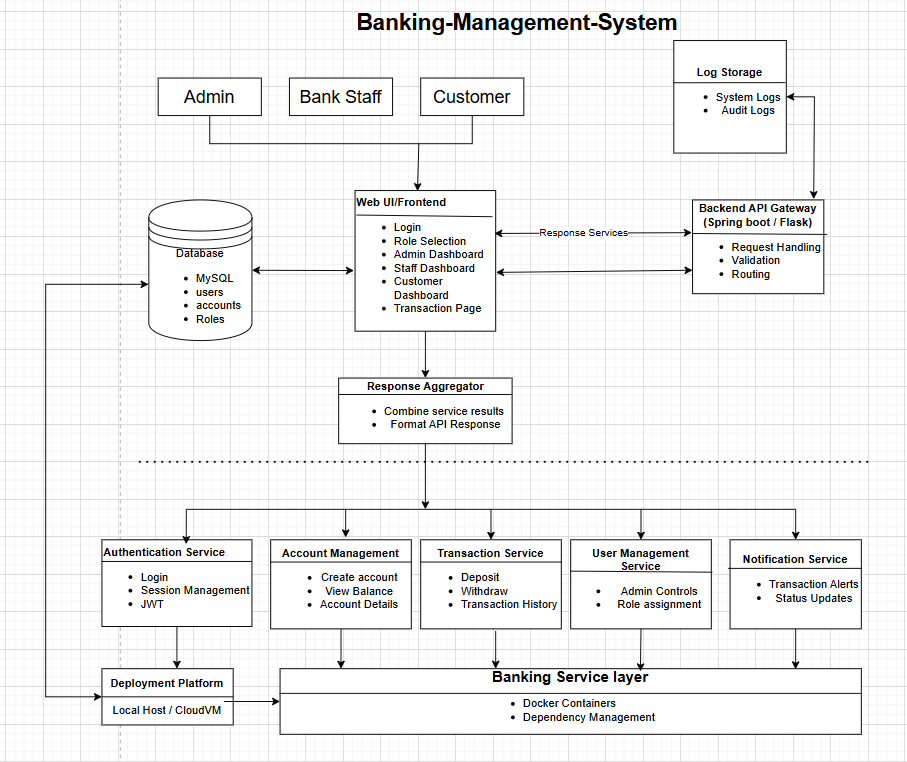

#  Banking Management System

A web-based Banking Management System to manage customer accounts, transactions, and administrative banking operations.


##  Project Overview

The Banking Management System is a software application designed to automate and manage core banking operations such as customer account management, transactions, and loan processing. The system aims to reduce manual effort, improve accuracy, and provide secure and efficient banking services. It serves as a centralized platform for administrators, bank staff, and customers to interact with banking data digitally. This project is developed as part of a **Software Engineering academic requirement**.


##  Problem It Solves

Traditional banking processes often rely on manual record keeping, which can lead to errors, data inconsistency, and delays.

Key problems addressed:
- Manual record maintenance
- Time-consuming transaction processing
- Higher chances of human error
- Difficulty for customers to access account information quickly

This system provides a digital solution that ensures faster processing, better data management, and improved user experience.


##  Target Users (Personas)

###  Admin
- Manages the overall system
- Monitors transactions and reports
- Controls user access and system security

###  Bank Staff
- Creates and manages customer accounts
- Performs deposits and withdrawals
- Processes fund transfers and loan-related activities

###  Customer
- Securely logs in to the system
- Views account balance and transaction history
- Performs basic banking operations such as fund transfers


##  Vision Statement

To build a **secure, reliable, and user-friendly digital banking system** that simplifies banking operations and enhances efficiency for both banks and customers.


##  Key Features / Goals

- User authentication and role-based access
- Customer account management
- Deposit and withdrawal operations
- Fund transfer between accounts
- Transaction history tracking
- Loan application and management
- Administrative monitoring and reporting


##  Success Metrics

- Accurate and error-free transaction processing
- Secure storage of customer and transaction data
- Users can complete tasks with minimal errors
- Fast and reliable system response


##  Assumptions & Constraints

- The system requires an active internet connection
- This is an academic project with limited time and scope
- The system uses a relational database (e.g., MySQL)
- Real-world banking regulations are simplified
- Security features are implemented at a basic academic level

## MoSCoW Prioritization

| Priority | Features |
|---------|----------|
| Must Have | User login, Account creation, Deposit money, Withdraw money |
| Should Have | Fund transfer, Transaction history |
| Could Have | Loan management, Reports |
| Won’t Have | Mobile application, Advanced analytics |

## Local Development Tools

The following tools were used to develop and run the Banking Management System locally:

- **Operating System:** Windows 10 / Windows 11  
- **Version Control:** Git & GitHub  
- **Containerization:** Docker Desktop  
- **Backend Framework:** Python (Flask)  
- **Frontend:** HTML with internal CSS  
- **Database:** MySQL (planned / placeholder for future integration)  
- **Code Editor:** Visual Studio Code  
- **Terminal:** Windows Command Prompt  

Docker is used to ensure a consistent local development environment without manually installing dependencies.


##  Quick Start – Local Development

This project uses Docker to run the Banking Management System locally without installing dependencies manually.
### Prerequisites

- Docker Desktop installed
- Git installed
- Web browser (Chrome / Edge / Firefox)


## Software Design

The Banking Management System follows a modular layered architecture that separates the user interface, backend services, and database. The system is designed with high cohesion and low coupling to improve maintainability and scalability.

Key design choices include role-based access control, a separate authentication module, and containerized deployment using Docker, which improve system organization, security, and ease of deployment.

### Architecture Diagram


## Steps to Run the Backend Locally

### Step 1: Clone the repository

git clone https://github.com/pranay2686/Banking-Management-System.git


### Step 2: Navigate to the backend folder

cd Banking-Management-System/backend
**Step 3: Build the Docker image**
```bash
docker build -t bms-backend .
```

**Step 4: Run the Docker container**
```bash
docker run -p 5000:5000 bms-backend
```

**Step 5: Open the application in your browser**
```bash
http://127.0.0.1:5000
```
